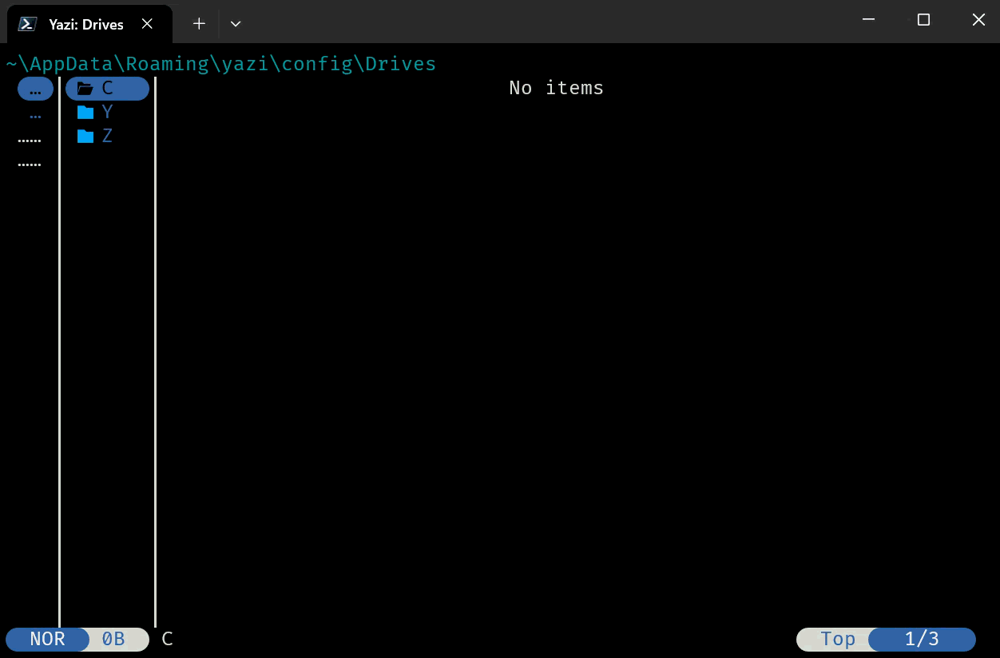

# parent-or-drives.yazi

A [Yazi](https://github.com/sxyazi/yazi) plugin for navigating Windows drives upon pressing left at some drive's root (e.g., `C:\`).

## Installation

1. Run: `ya pkg add AvivYaish/parent-or-drives`
2. Add to `YAZI_CONFIG_HOME/keymap.toml`:
  ```toml
  [mgr]
  prepend_keymap = [
      { on = "<Left>",  run = "plugin parent-or-drives",          for = "windows" },
      { on = "h",       run = "plugin parent-or-drives",          for = "windows" },
      { on = "<Right>", run = "plugin parent-or-drives -- enter", for = "windows" },
      { on = "l",       run = "plugin parent-or-drives -- enter", for = "windows" },
      { on = "<Enter>", run = "plugin parent-or-drives -- open",  for = "windows" },
  ]
  ```
3. Restart Yazi


<center>



</center>